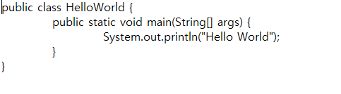

# 자바 개발순서

## 자바 개발순서

1. 소스 작성
2. 소스 컴파일 (javac)
3. JVM을 이용하여 실행 (java)

## 텍스트 파일을 직접 생성

---

- [HelloWorld.java](http://helloworld.java) 파일을 생성 및 텍스트 파일에서 아래와 같이 작성 후 저장

- cmd에서 해당 경로에서 파일 확인 (dir)

    

- 컴파일(javac) ⇒ 파일 실행 (java)

## Eclipse에서 실행

---

- eclipse.exe 실행
- 작업 디렉토리 선택 (파일 > Switch Workspace > 경로 지정)

    

- 프로젝트 생성 (파일 > New > Other)

    

    java 프로젝트 선택 

    

    프로젝트명 작성 후 저장

    

- 생성된 프로젝트에서 class 생성

    

    

 - 생성된 클래스 모습

- 소스 코드 작성 후 저장 (⇒ 자동 컴파일 ⇒ bin 디렉토리에 class 생성)

    - 소스파일 (.java / src 폴더)

    - 컴파일된 파일 (.class / bin 폴더)

    

- 컴파일된 파일 실행

    

    - 콘솔에서 실행결과 확인

    